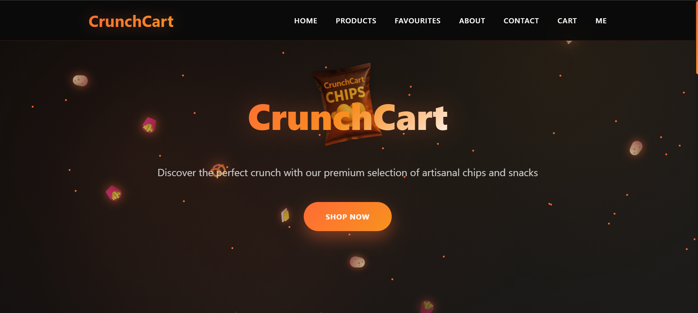
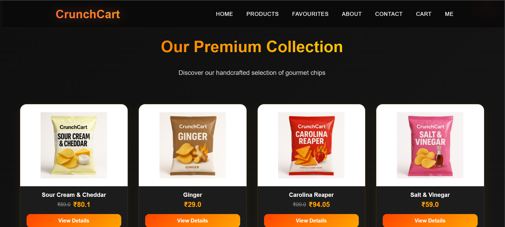
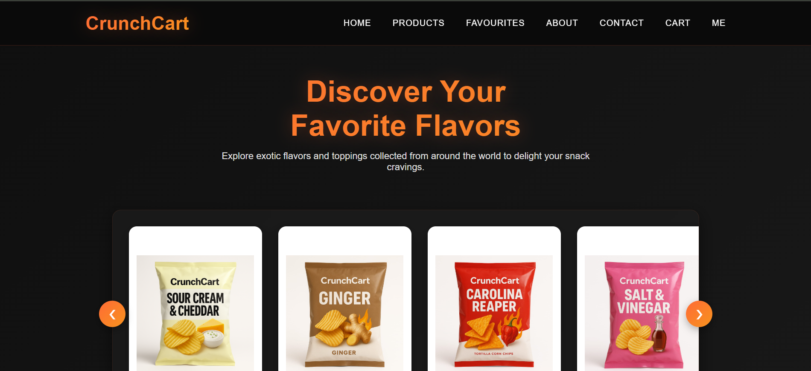
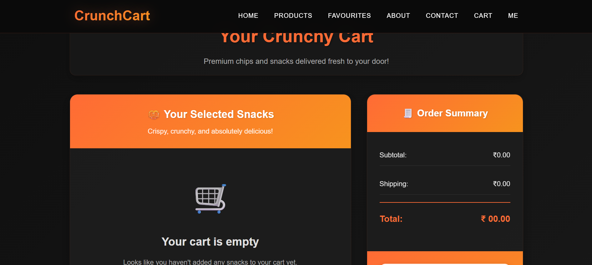

# CrunchCart

CrunchCart is a modern, full-stack web application for discovering, browsing, and ordering premium artisanal chips and snacks. Designed with a sleek dark theme and a focus on user experience, CrunchCart provides a seamless shopping journey from product discovery to order management.

---

## Features

- **User Authentication:**  
  Secure registration, login, and session management for customers and admins.

- **Product Catalog:**  
  Browse a curated selection of chips and snacks, each with detailed descriptions, images, and discounts.

- **Cart & Checkout:**  
  Add products to your cart, adjust quantities, and place orders with a simple, intuitive interface.

- **Order Management:**  
  View your order history, track order status, and see detailed order information.

- **Admin Dashboard:**  
  Manage products, view sales statistics, handle customer orders, and monitor user activity with a powerful admin panel.

- **Reviews & Ratings:**  
  Customers can leave reviews and ratings for products they've purchased, helping others make informed choices.

- **Contact & Support:**  
  Built-in contact form for customer inquiries, with pre-filled user information for logged-in users.

- **Responsive Design:**  
  Fully responsive and mobile-friendly, with a visually appealing dark mode and modern UI components.

---

## Tech Stack

- **Backend:** Python, Flask, SQLAlchemy
- **Frontend:** HTML5, CSS3, JavaScript, Jinja2 templating
- **Database:** MySQL (or SQLite for development)
- **Authentication:** Flask-Login, Flask-WTF
- **Other:** Font Awesome, custom CSS animations, responsive layouts

---

## Getting Started

1. **Clone the repository:**
   ```sh
   git clone https://github.com/Pratikkumartulo/CrunchCart.git
   cd CrunchCart
   ```

2. **Install dependencies:**
   ```sh
   pip install -r requirements.txt
   ```

3. **Set up the database:**
   - Configure your database URI config file.
   - Run the initial migration scripts if needed.

4. **Run the application:** 
   ```sh
   python app.py
   ```

5. **Access the app:**
   - Open [http://localhost:5000](http://localhost:5000) in your browser.

---

## Folder Structure

```
CrunchCart/
│
├── static/                # Static files (CSS, JS, images)
├── templates/             # Jinja2 HTML templates
├── app.py                 # Main Flask application
├── db.py                  # Database setup
├── models.py              # SQLAlchemy models
├── order.py               # Order management logic
├── review.py              # Review management logic
├── users.py               # User management logic
├── requirements.txt       # Python dependencies
└── README.md              # Project documentation
```

---

## Screenshots

> _Add screenshots of your home page, product page, cart, admin dashboard, etc. here for a visual overview._






## Contributing

Pull requests are welcome! For major changes, please open an issue first to discuss what you would like to change.

---

## Credits

- UI/UX inspired by modern e-commerce platforms.
- Built with Flask, SQLAlchemy, and open-source libraries.

---

**CrunchCart** – Discover the perfect
